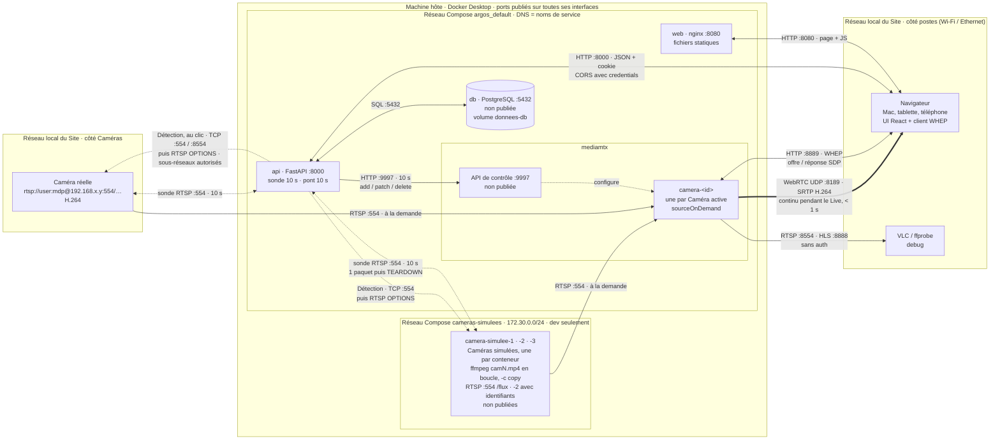

# Schéma des Flux

Tout ce qui circule dans un Site ArgOS 0.4.0, des Caméras jusqu’au navigateur : protocoles, ports, réseaux et conteneurs. Source de vérité : `compose.yaml` (prod), `compose.simulation.yaml` (Caméras simulées, dev seulement), `media/mediamtx.yml`, [ADR 0001](../adr/0001-mediamtx-en-pont.md). Limites de sécurité : [docs/securite.md](../securite.md).

Lecture : trait plein = flux continu ou à la demande ; trait épais = vidéo vers le navigateur ; pointillés = sonde et pilotage ; double flèche = requête / réponse. Les deux cadres « Réseau local du Site » sont **le même** réseau, coupé en deux pour que la vidéo se lise de gauche à droite.



## Les Flux, un par un

| De → vers | Protocole · port | Quand | Ce qui passe |
|---|---|---|---|
| ffmpeg → Caméra simulée (`flux`) | RTSP · `127.0.0.1:554`, dans chaque conteneur `camera-simulee-N` (dev) | en continu | la vidéo de dev, sans réencodage : seul flux vidéo permanent du Site |
| `api` → `db` | SQL · `db:5432` | à chaque requête | Caméras, sessions, états |
| `api` → `mediamtx` | HTTP · `mediamtx:9997` (API de contrôle) | toutes les 10 s | ajoute / modifie / retire les chemins `camera-<id>` selon les Caméras actives ; rien d’autre n’est touché |
| `api` → chaque adresse des sous-réseaux autorisés | TCP · ports caméra (`554,8554` par défaut), puis RTSP `OPTIONS` | à chaque Détection (clic dans l’Administration), une dizaine de secondes | connexion, puis `OPTIONS` sans chemin ni identifiants ; une ligne de statut RTSP en retour → Candidat |
| `api` → chaque Candidat | HTTP · `:8000` `GET /api/instance` | à chaque Détection, Candidats seulement | jeton d’instance : celui qui renvoie le jeton de cette API est ArgOS lui-même, écarté |
| `api` → chaque Caméra active | RTSP/TCP · `:554` (`camera-simulee-N` en dev, IP du réseau local pour une réelle) | toutes les 10 s, quelques ms | `DESCRIBE`, `SETUP`, `PLAY`, un paquet vidéo, `TEARDOWN` → `online` / `offline` |
| `mediamtx` (`camera-<id>`) → source de la Caméra | RTSP/TCP | seulement pendant qu’un navigateur regarde | le Flux de la Caméra, relayé sans réencodage |
| navigateur → `web` | HTTP · `:8080` | au chargement | `index.html` et le JS de l’UI |
| navigateur → `api` | HTTP · `:8000` | connexion, Administration (10 s), Live (10 s), Détection (`POST /api/detection`, synchrone) | JSON, cookie `argos_session` |
| navigateur → `mediamtx` | HTTP · `:8889` (WHEP) | à chaque Caméra affichée dans le Live | négociation SDP et candidats ICE |
| `mediamtx` → navigateur | WebRTC · UDP `:8189` | pendant le Live, une connexion à la fois | vidéo H.264 en SRTP |
| VLC / ffprobe → `mediamtx` | RTSP `:8554`, HLS `:8888` | à la demande | lecture directe des `camera-<id>` (debug) ; les Caméras simulées ne sont pas publiées |

## Réseaux

- **Réseau Compose `argos_default`** : un réseau Docker privé, créé par `docker compose`. Les conteneurs s’y joignent par leur nom de service (`db`, `mediamtx`, `api`, `web`). Il est **le seul** à voir `db:5432` et `mediamtx:9997`.
- **Réseau Compose `cameras-simulees`** (dev seulement, `compose.simulation.yaml`) : sous-réseau fixe `172.30.0.0/24`, où vivent les trois Caméras simulées. `api` (sonde, Détection) et `mediamtx` (pont) le rejoignent et les y joignent comme de vraies caméras, sur le port 554. Le fichier de simulation ajoute ce sous-réseau à `ARGOS_DETECTION_CAMERAS_SOUS_RESEAUX`. La stack de prod (`compose.yaml` seul) n’a ni ce réseau ni Caméras simulées.
- **Ports publiés** sur la machine hôte, donc joignables depuis tout le réseau local : `8080` (UI), `8000` (API), `8889/tcp` + `8189/udp` (WebRTC), `8554` (RTSP), `8888` (HLS).
- **Réseau local du Site** (Wi-Fi ou Ethernet) : les navigateurs y joignent la machine hôte par son IP, et la machine hôte y joint les Caméras réelles. Docker Desktop fait sortir `api` et `mediamtx` vers ce réseau par la machine hôte (NAT).
- **WebRTC hors de la machine hôte** : MediaMTX doit annoncer l’IP de la machine (`MTX_WEBRTCADDITIONALHOSTS` dans `.env`), et l’origine de l’UI doit figurer dans `ARGOS_ORIGINES_AUTORISEES`.
- **En clair** : tout circule en HTTP et RTSP non chiffrés sur le réseau local, à part la vidéo WebRTC (SRTP). Les Flux se lisent sans authentification. Pas de vraies caméras avant HTTPS et l’authentification des Flux ([feuille de route](feuille-de-route-dev.md)).

## Détection

La Détection n’est pas un Flux vidéo : c’est un balayage court, lancé par l’Administrateur, qui part de `api`. Les sous-réseaux balayés viennent de la machine hôte, hors de Docker : `scripts/cameras/configurer-detection.sh` lit l’adresse de la ou des prises des caméras et l’écrit dans `.env` (`ARGOS_DETECTION_CAMERAS_SOUS_RESEAUX`), que Compose passe à `api` au démarrage ([ADR 0002](../adr/0002-detection-depuis-le-reseau-bridge.md)) ; en dev, `compose.simulation.yaml` y ajoute `172.30.0.0/24`.

```
machine hôte : configurer-detection.sh ──écrit──▶ .env ──Compose──▶ api
navigateur ──POST /api/detection──▶ api ──TCP + RTSP OPTIONS──▶ sous-réseaux autorisés
                                    api ──GET /api/instance :8000──▶ Candidats (écarte ArgOS)
                                    api ◀──SQL──▶ db (Caméras déjà configurées)
```

Explication complète, ce qu’elle envoie et ce qu’elle ne fait pas : [Réseau du Site et Détection des Caméras](../cameras/reseau-et-detection.md) ; limites : [sécurité](../securite.md#détection--argos-agit-sur-le-réseau).
